# Projects Status
    
    
    
## Completed Projects 
    
     
  
### 1. Autacc Report

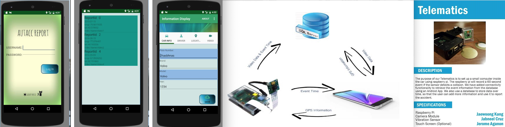

This app lets you retrieve the incident that was recorded by the collision hardware and add more information about the incident.
The hardware will record the video, location of the incident and the time and date of the incident.
  
**Recording Video**: Raspberry Pi and Pi Cam  
**Application**: Android Studio  
**Programming Languages**: Python for Raspberry Pi application, Java for Android application    

### 2. Jelly Pal Android Application

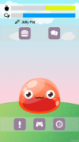

Jelly Pal is an interactive friend who lives in your phone and helps manage your mental health 
You can talk to your Jelly Pal and feed it, just like a real pet 
Jelly Pal even has two games, a rhythm game to distract you and a breathing game to help deal with panic attacks 
You can also schedule reminders so that the Jelly Pal will remind you when to take your medication 

**Feature Section**

* **Rhythm Game** - To help the player deal with anxiety our rhythm game distracts the player by having them focus on tapping on small stars at very precise moments
* **Microphone Game** - To help the player deal with panic attacks our microphone game visually rewards the player for blowing into the microphone in such a way that has been studied to help with releaving panic attacks
* **Medication Scheduling** - To help remind the player to take their medications at the correct times their is a scheduling system so the player can set what medication, and what times/dates they need to take said medication. Notifications are sent when the player needs to take said medication
* **Dialog System** - To give the player "someone" to talk to we implemented a chat tree style dialog system so that the player can "talk" to the jelly
* **Environment Effects** - The background of the jelly changes dependent on time and weather of the location of the player    

### 3. Belphegor RPG Game

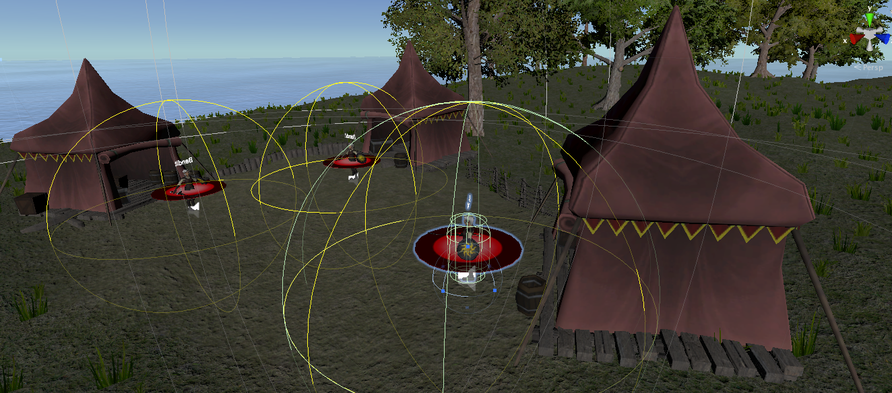

A dungeon crawler RPG with spells, monsters, fast-paced combat, and treasure hunting elements. Choose your class and prepare for adventure

**Target Platform**: Windows7 or Higher 
**Development Tool**: Unity 
**Important Assets**: uMMORPG Realistic Effects Pack 4, Heroic Fantasy Creatures Pack Vol 1   

### 4. DAlChemistry AR 

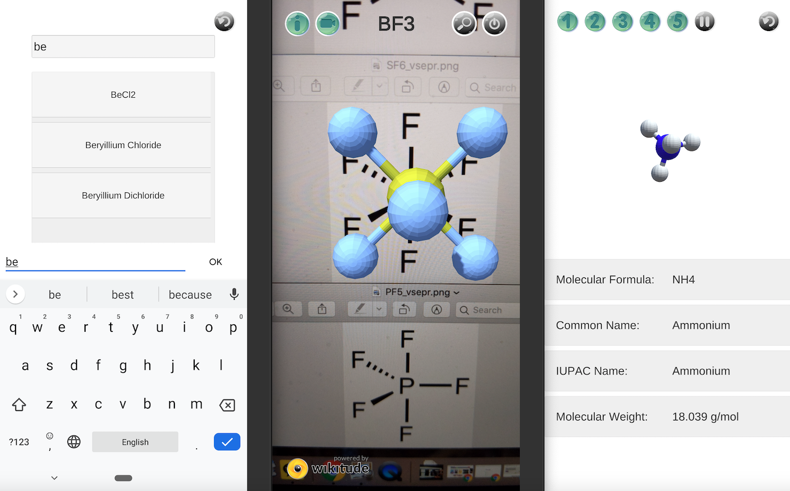

This is a simple AR android application that can generate a molecular 3D model from image.
user can check the molecular 3D models from target images or inputs, and can view its animation.

**Target**: Dalhousie University Chemistry Students 
**Target Platform**: Android SDK 26, Min SDK 23 
**Development Tool**: Unity 
**Important API**: Wikitude AR   

### 5. ButaRamen Wage Calculator for Android

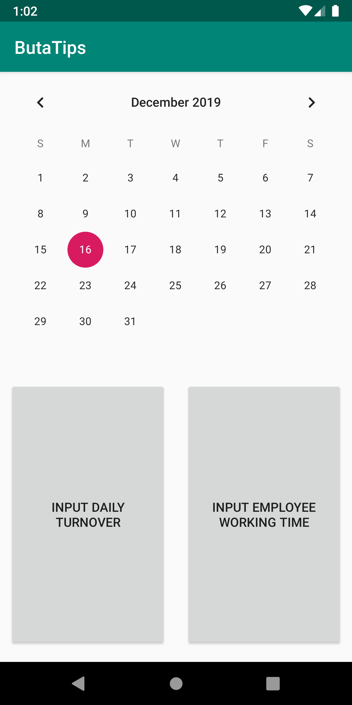

This is simple wage calculator for a specific restraunt 
User can calculate all employees' wages and tips and store all results and data into Mysql database or Firebase 
 
**Target Platform**: Android SDK 26, Min SDK 26 
**Development Tool**: Android Studio 
**Progress**: 70% done (Initial version of UIs and activities, Calculator functions, Communication between app and Firebase has been completed) 

*Currently stopped due to the changing target platforms*     

## Projects in Progress

### 1. Cat in the Zoo Game

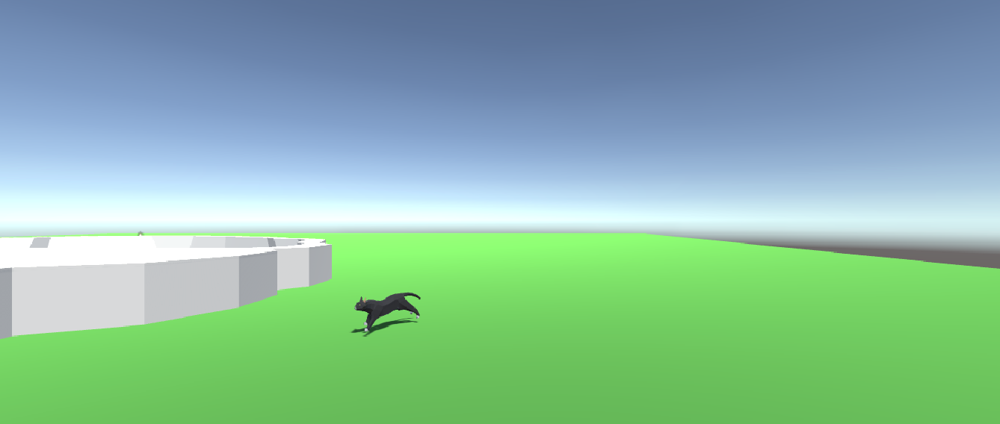

Simple mobie adventure game. Player should control a cat to get more food in the zoo 

**Target Platform**: Android or IOS 
**Development Tool**: Unity 
**Progress**: 10% done (Player controller, added animations for idle, run, walk, jump, and attack are completed)   

### 2. Buta Calculator Unity

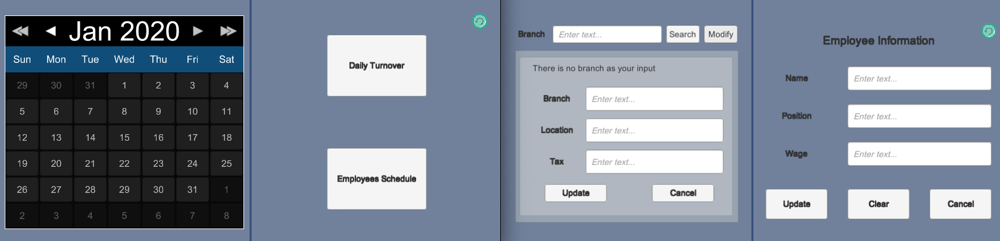

This is a simple calculator for calculating all employees' wages and tips 
Due to the request of a restraunts' owner, modified all codes for multiple branches in Atlantic Area 
Target platform is also changed to multiplatform such as OSX, IOS, and Android 

**Target Platform**: Windows, OSX, Android, and IOS 
**Development Tool**: Unity 
**Using Database**: Firebase 
**Progress**: 50% done (Communication between application and Firebase, all initial version of UI)  

### 3. Webapplication for Illustrator

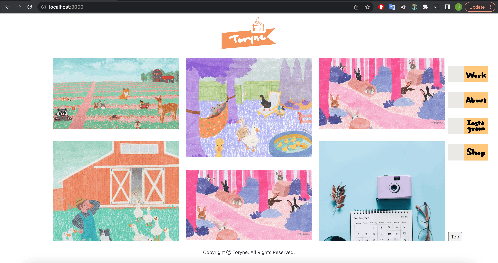

This project is to develop a simple single page webapplication for an Illustrator 

**Development Tool**: Visual Studio Code 
**For Back-End development: NodeJS 
**For Front-End development: React 
**For Style: styled-components & antDesign 
**Using Database**: MongoDB 
**Progress**: 40% done (completed Login function and Upload Images) 
**Git Repository: https://github.com/JKang97/TolyneGallery

### 4. Scraper for Appliances Parts

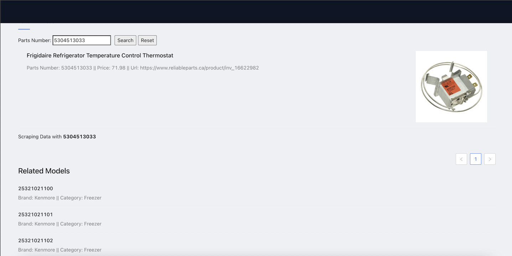

This project is to develop a scraper tool from several target sites 

**Development Tool**: Visual Studio Code 
**For Back-End development: NodeJS 
**For Front-End development: React 
**For Style: styled-components & antDesign 
**Primary Package: Puppeteer
**Progress**: 100% done!

### 5. Warehouse Appliances and Parts Application

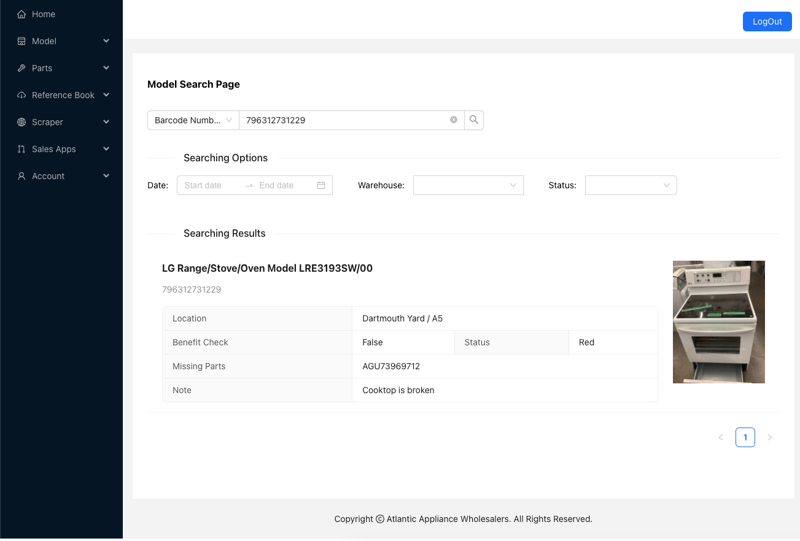
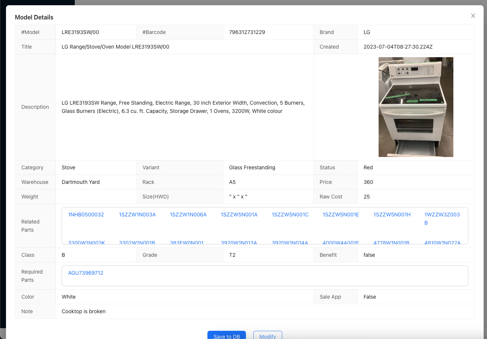

This project is to develop a new system that supports all warehouse works 

**Development Tool**: Visual Studio Code 
**For Back-End development: Nestjs(Typescript) 
**For Front-End development: React(Javascript) 
**Database: MySQL 8.0
**Progress**: 95% done!
